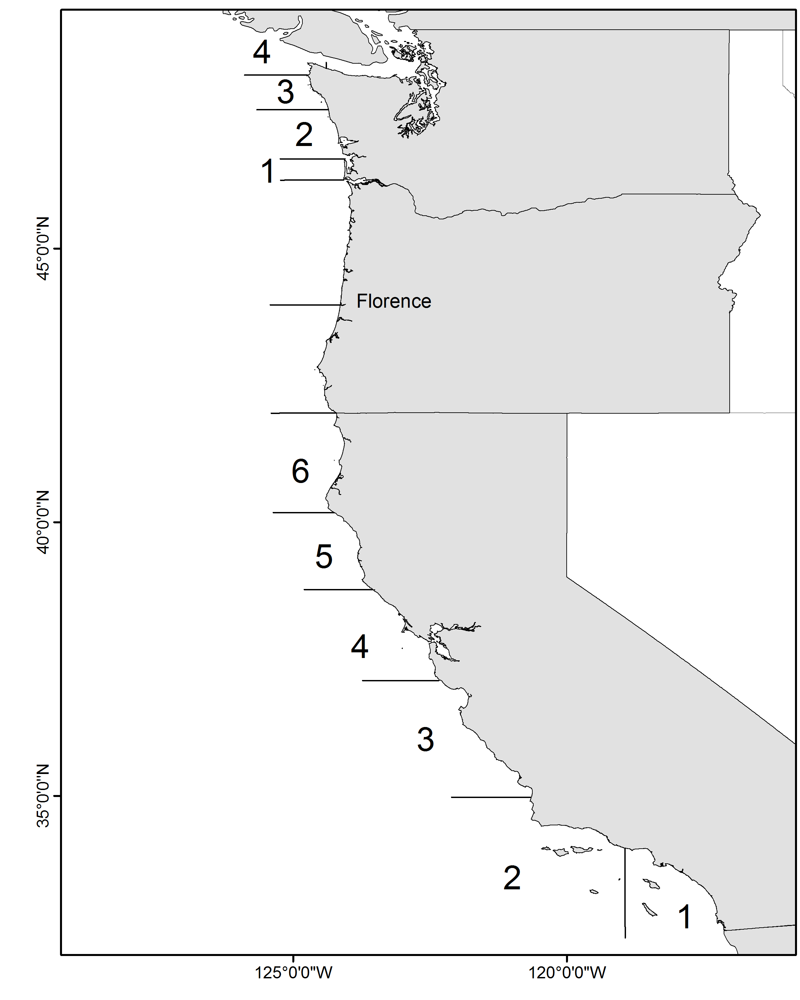
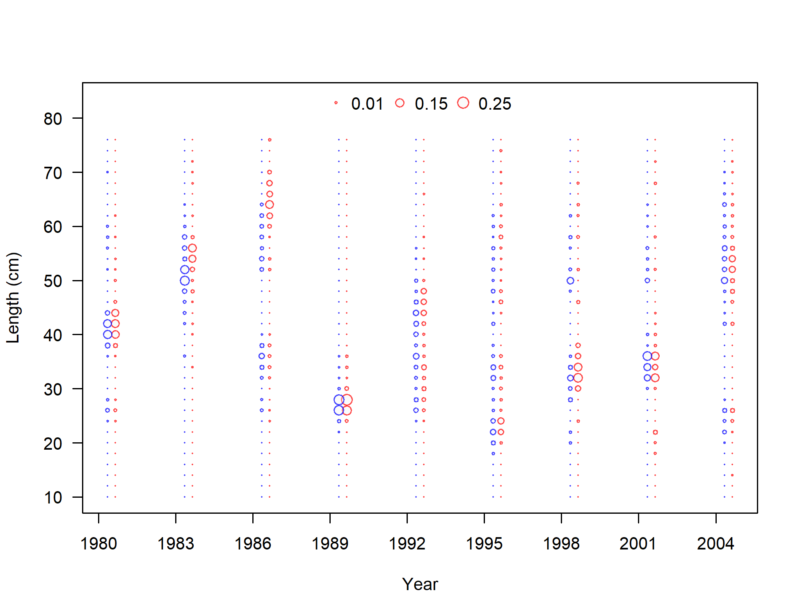

<!-- ====================================================================== -->
<!-- **************************             ******************************* --> 
<!-- **************************BEGIN FIGURES******************************* --> 
<!-- **************************             ******************************* -->
<!-- ====================================================================== -->
\FloatBarrier

\newpage

#Figures

<!-- ====================================================================== --> 
<!-- *********************INTRODUCTION FIGURES***************************** --> 
<!-- ====================================================================== --> 

<!-- ********************************************************************** --> 
<!-- *************************Data FIGURES********************************* --> 
<!-- ********************************************************************** -->

\FloatBarrier

<!-- ********************************************************************** -->
<!-- ****************Fleet 4 Rec. PR Index FIGURES************************* -->
<!-- ********************************************************************** --> 

\FloatBarrier 

\FloatBarrier

\FloatBarrier
<!-- ********************************************************************** -->
<!-- ***************Fleet 5 CPFV logbook index FIGURES*********************--> 
<!-- ********************************************************************** -->

\FloatBarrier

\FloatBarrier

<!-- ********************************************************************** -->
<!-- ***************Fleet 5 MRFSS dockside index FIGURES********************--> 
<!-- ********************************************************************** -->

\FloatBarrier

<!-- ********************************************************************** -->
<!-- *************Recreational onboard observer FIGURES******************** --> 
<!-- ********************************************************************** -->

\FloatBarrier
<!-- ********************************************************************** -->
<!-- *************Fleet 7 Sanitation survey FIGURES************************ --> 
<!-- ********************************************************************** -->

\FloatBarrier

\FloatBarrier
<!-- ********************************************************************** -->
<!-- *************Fleet 8 NWFSC Trawl survey FIGURES***)***************** --> 
<!-- ********************************************************************** -->

\FloatBarrier

\FloatBarrier

{height=95%}

{height=95%}

\FloatBarrier
<!-- ********************************************************************** -->
<!-- *************Fleet 9 Gillnet survey FIGURES*************************** --> 
<!-- ********************************************************************** -->

\FloatBarrier
<!-- ********************************************************************** -->
<!-- *************Fleet 11 Bight trawl survey FIGURES********************** --> 
<!-- ********************************************************************** -->

\FloatBarrier 

<!-- ********************************************************************** -->
<!-- *************Fleet 10 Impingement survey FIGURES********************** --> 
<!-- ********************************************************************** -->

\FloatBarrier

