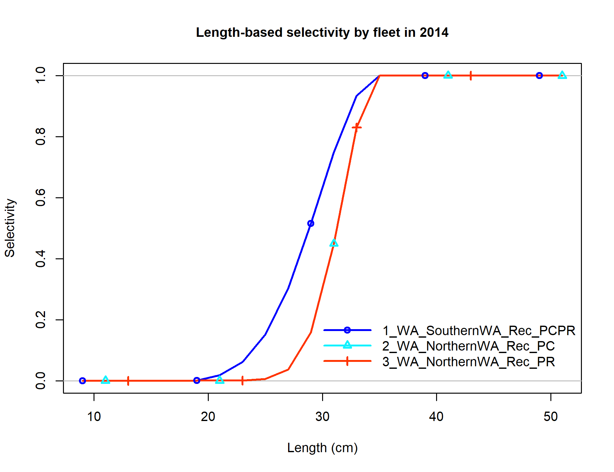
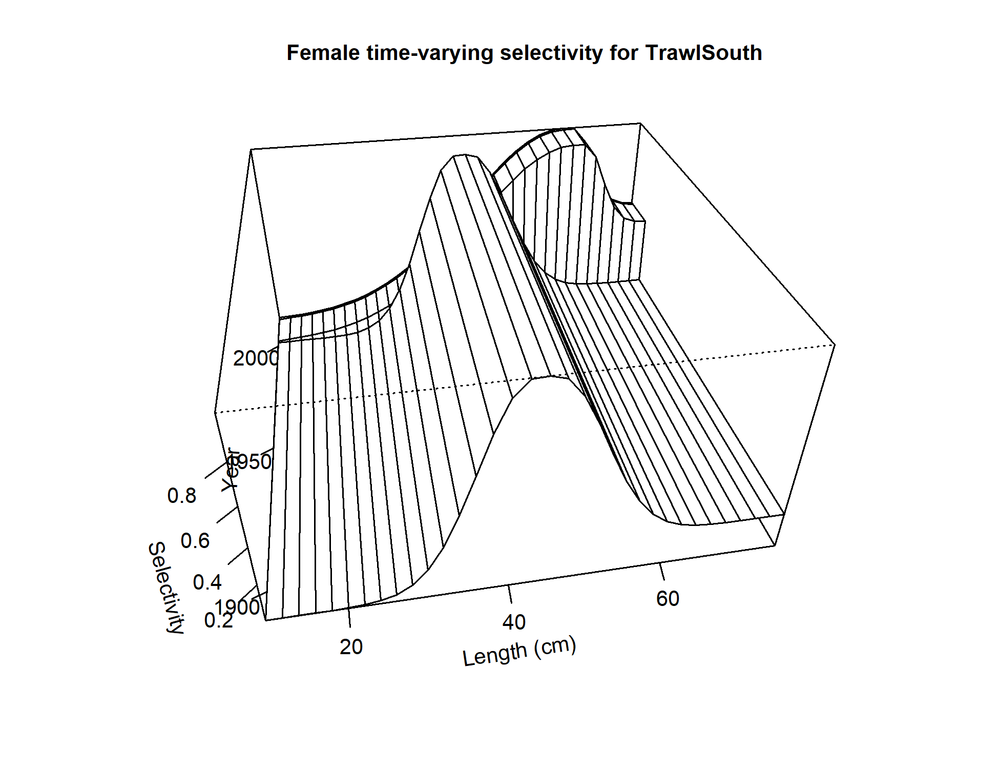
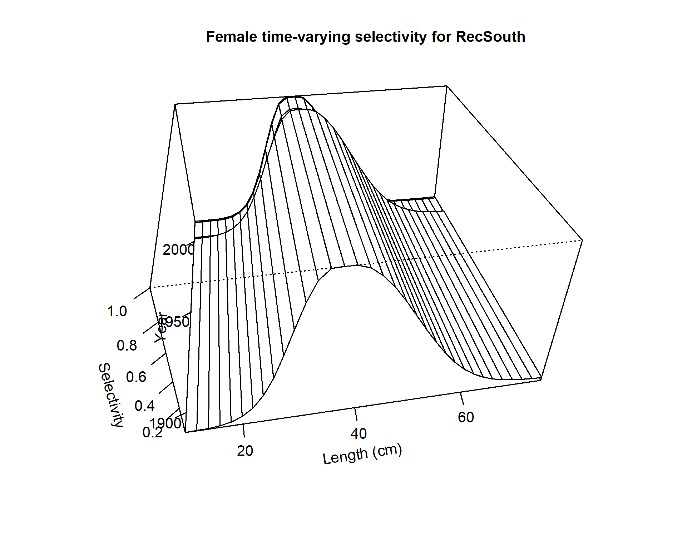
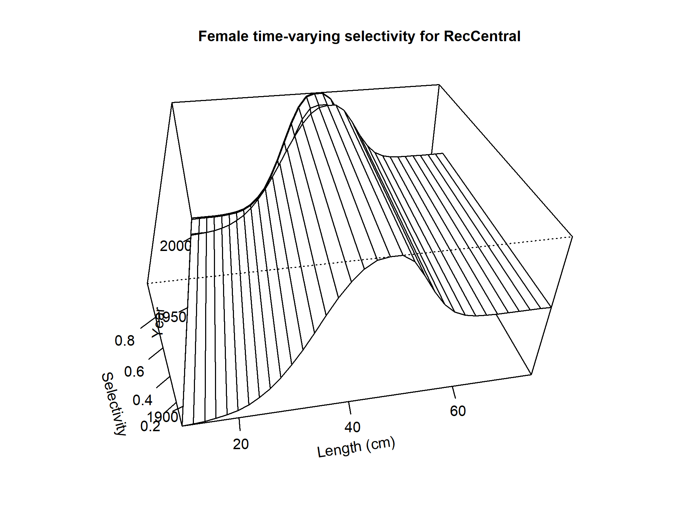
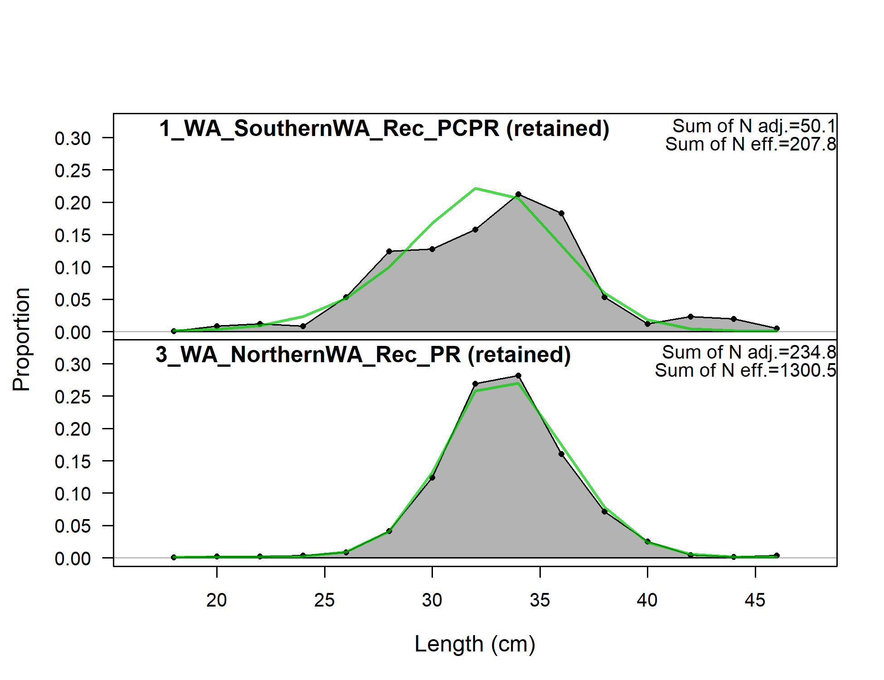
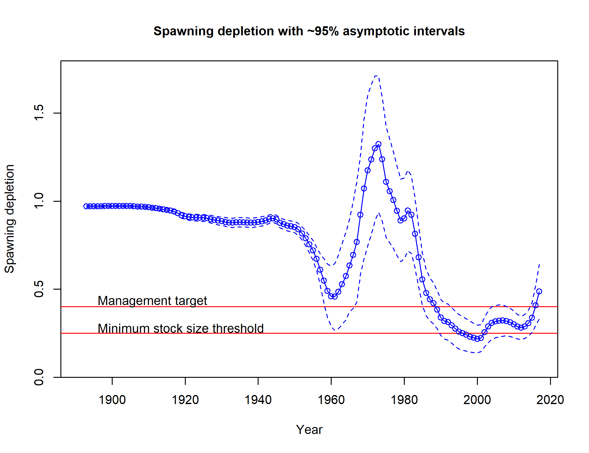

---
output:
  pdf_document: default
  html_document: default
---
<!-- ********************************************************************** -->
<!-- ***********FIGURES: Model results ********************************** --> 
<!-- ********************************************************************** -->

\FloatBarrier

<!-- ********************************************************************** -->
<!-- ***********History of modelleing approaches FIGURES******************* --> 
<!-- ********************************************************************** -->


{height=95%}


<!-- ********************************************************************** -->
<!-- ****************STAR PANEL Recommendations FIGURES******************** --> 
<!-- ********************************************************************** -->


\vspace{5cm}


\newpage


{height=90%}

{height=90%}


<!-- ********************************************************************** -->
<!-- ****************Model description section FIGURES********************* --> 
<!-- ********************************************************************** -->


\FloatBarrier

<!-- ====================================================================== -->
<!-- *********************BASE MODEL FIGURES******************************* -->
<!-- ====================================================================== -->

<!-- ***********MODEL 1 BASE MODEL FIGURES********************************* --> 
 


\FloatBarrier


\FloatBarrier












\FloatBarrier


_with_95_asymptotic_intervals.png)


<!-- ***********Fits to the data********************************* --> 


<!--


-->




\FloatBarrier


```{r, results='asis'}
#     # Plot all of the timeseries plots
     for(i in 4:dim(AALComp_mod1)[1]) {
#         
#      # find matches to multi-page plots
      page_test = sapply(multi_page_fig, grepl, AALComp_mod1$label[i])
#      
#      # if the plot is page2+ of a series, add the extra caption
      if(TRUE %in% page_test) {
        cat('\n', sep='')
#       
        cat('\\begin{center} \n
              Figure continued from previous page \n
             \\end{center}',sep='')
#        
      } else {
#      
    cat('\n![', AALComp_mod1[i,caption_col], ' \\label{fig:mod1_', i, '_', AALComp_mod1[i, label_col], '}](', AALComp_mod1[i, path_col], ')\n', sep='')
 } }
```


![Mean age for NWFSC trawl survey with 95% confidence intervals based on current samples sizes. Francis data weighting method TA1.8: thinner intervals (with capped ends) show result of further adjusting sample sizes based on suggested multiplier (with 95% interval) is `r paste0(Fweights[12,6], ' (',Fweights[12,9],'-', Fweights[12,10],')')`. For more info, see Francis et al. (2011). \label{fig:comp_condAALfit_data_weighting_TA1.8_condAgeNWFSCTrawl}](r4ss/plots_mod1/comp_condAALfit_data_weighting_TA1.8_condAgeNWFSCTrawl.png)
 
 
![Mean length for the POTW trawl surveys with  95% confidence intervals based on current samples sizes. Francis data weighting method TA1.8: thinner intervals (with capped ends) show result of further adjusting sample sizes based on suggested multiplier (with 95% interval) is `r paste0(Fweights[7,6], ' (',Fweights[7,9],'-', Fweights[7,10],')')`. For more info, see Francis et al. (2011). \label{fig:comp_lenfit_data_weighting_TA1.8_Sanitation}](r4ss/plots_mod1/comp_lenfit_data_weighting_TA1.8_Sanitation.png)


![Mean length for the Impingement surveys with  95% confidence intervals based on current samples sizes. Francis data weighting method TA1.8: thinner intervals (with capped ends) show result of further adjusting sample sizes based on suggested multiplier (with 95% interval) is  `r paste0(Fweights[10,6], ' (',Fweights[10,9],'-', Fweights[10,10],')')`. For more info, see Francis et al. (2011). \label{fig:comp_lenfit_data_weighting_TA1.8_Impingement}](r4ss/plots_mod1/comp_lenfit_data_weighting_TA1.8_Impingement.png)


![Mean length for the recreational private boat fleet with  95% confidence intervals based on current samples sizes. Francis data weighting method TA1.8: thinner intervals (with capped ends) show result of further adjusting sample sizes based on suggested multiplier (with 95% interval) is  `r paste0(Fweights[4,6], ' (',Fweights[4,9],'-', Fweights[4,10],')')`. For more info, see Francis et al. (2011). \label{fig:comp_lenfit_data_weighting_TA1.8_RecPR}](r4ss/plots_mod1/comp_lenfit_data_weighting_TA1.8_RecPR.png)


![Mean age for recreational party/charter retained-catch fleet with 95% confidence intervals based on current samples sizes. Francis data weighting method TA1.8: thinner intervals (with capped ends) show result of further adjusting sample sizes based on suggested multiplier (with 95% interval) is `r paste0(Fweights[5,6], ' (',Fweights[5,9],'-', Fweights[5,10],')')`. For more info, see Francis et al. (2011).\label{fig:comp_lenfit_data_weighting_TA1.8_RecPC}](r4ss/plots_mod1/comp_lenfit_data_weighting_TA1.8_RecPC.png)


![Mean age for recreational discard-catch fleett with 95% confidence intervals based on current samples sizes. Francis data weighting method TA1.8: thinner intervals (with capped ends) show result of further adjusting sample sizes based on suggested multiplier (with 95% interval) is `r paste0(Fweights[6,6], ' (',Fweights[6,9],'-', Fweights[6,10],')')`. For more info, see Francis et al. (2011). \label{fig:comp_lenfit_data_weighting_TA1.8_RecDD}](r4ss/plots_mod1/comp_lenfit_data_weighting_TA1.8_RecDD.png)

\FloatBarrier


<!-- ********************************************************************** -->
<!-- ****************Uncertainty and Sensitivity FIGURES******************* -->
<!-- ********************************************************************** -->


<!-- ***********MODEL 1 Uncertainty and Sensitivity FIGURES**************** --> 


\FloatBarrier


<!-- ********************************************************************** -->
<!-- *****************Retrospective analysis FIGURES*********************** -->
<!-- ********************************************************************** -->

<!-- ***********MODEL 1 Retrospective analysis FIGURE********************** --> 


\FloatBarrier


<!-- ********************************************************************** -->
<!-- ******************Likelihood profile FIGURES************************** --> 
<!-- ********************************************************************** -->

<!-- ***********R0 Likelihood profile FIGURES****************************** --> 


  


\FloatBarrier
<!-- ***********h Likelihood profile FIGURES******************************* -->


<!-- ***********M Likelihood profile FIGURES******************************* -->


\FloatBarrier
<!-- ********************************************************************** -->
<!-- *********************REFERENCE POINTS FIGURES************************* --> 
<!-- ********************************************************************** -->

<!-- ***********MODEL 1 REFERENCE POINTS FIGURES*************************** --> 


_with_95_asymptotic_intervals_intervals.png)





\FloatBarrier
<!-- ********************************************************************** --> 
<!-- *************************FORECAST FIGURES***************************** --> 
<!-- ********************************************************************** --> 
