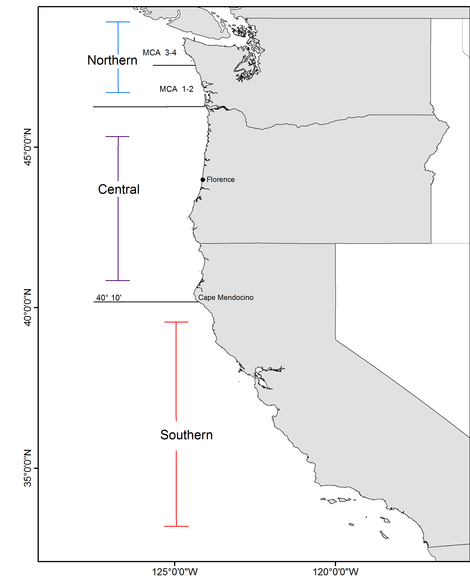

```{r global_options, include=FALSE}
    # set global options for R code chunks: echo=FALSE (don't include source code); 
    # warning=FALSE (suppress R warnings); message=FALSE (suppress R messages)
    # eval = TRUE is default
    knitr::opts_chunk$set(echo = FALSE, warning = FALSE, message = FALSE)
```

```{r}
    # Read in preamble R code - including required libraries and the SS file(s)
    source('./Rcode/Preamble.R')
 
    # Read in data/manipulations for executive summary tables and figures
    # It may take time to edit this file and get it ready for your assessment
    # Make small changes in this file and then try to compile the document
    # Commit when you have a success!
    source('./Rcode/Exec_summary_figs_tables.R')
```
\setlength{\parskip}{5mm plus1mm minus1mm}
\pagebreak

\pagenumbering{arabic}
\setcounter{page}{1}
\renewcommand{\thefigure}{\alph{figure}}
\renewcommand{\thetable}{\alph{table}}


#Executive Summary{-}

##Stock{-}
\hl{Include: species/area, including an evaluation of any potential biological basis 
for regional management.}

This assessment reports the status of the `r spp` (\emph{`r spp.sci`}) resource 
in U.S. waters off the coast of the California, Oregon, and Washington using data 
through `r LastYR-1`.  Etc...


##Catches{-}
\hl{Include: trends and current levels-include table for last ten years and graph with 
long term data}

Catch figure(s) with fleets: (Figures \ref{fig:Exec_catch1}-\ref{fig:Exec_catch3})    
Catch table:                 (Table \ref{tab:Exec_catch})


\FloatBarrier

<!-- ***********BEGIN EXECUTIVE SUMMARY CATCH FIGURES AND TABLES*********** -->
<!-- ***********Edit the Plot_catch tables and captions******************** -->
<!-- ***********This depends on how many plots you need******************** -->
<!-- ***********Also included is the r4SS plot - keep or remove************ -->
<!-- ***********CATCH FIGURES********************************************** -->
```{r, fig.cap= paste(spp, 'landings in ..... \\label{fig:Exec_catch1}',sep=' ')}
    # CSV: './txt_files/Exec_catch_for_figs.csv'
    # Note: you cannot have carriage returns in the R options line
    # Plot washington catches           
    Plot_catch(Catch_df = Exec_region1_catch)
```

```{r, fig.cap=paste('Stacked line plot of', spp,' landings history for Oregon by fleet (recreational and commercial). \\label{fig:Exec_catch2}',sep=' ')}
    # Plot Oregon catches
    Plot_catch(Catch_df = Exec_region2_catch)
```

```{r, fig.cap=paste('Stacked line plot of', spp, 'landings history for California by fleet (recreational and commercial). \\label{fig:Exec_catch3}',sep=' ')}
     # Plot California catches  
      Plot_catch(Catch_df = Exec_region3_catch)
```


<!-- ***********CATCH TABLE************************************************ -->
```{r, results='asis'}
    #CSV: './txt_files/Exec_catch_summary.csv'
    # Catch table section in R_exec_summary_fig_tables.R
    # Print the table
    print(Exec_catch.table, include.rownames = FALSE, caption.placement = 'top')
```
<!-- ***********END EXECUTIVE SUMMARY CATCH FIGURES AND TABLES************* -->


\FloatBarrier


\newpage

##Data and Assessment{-}
\hl{Include: date of last assessment, type of assessment model, data available, new 
information, and information lacking.}

`r spp` was assessed....  This assessment uses the newest version of Stock 
Synthesis (3.24u).  The model begins in `r Dat_start`, and assumes the stock 
was at an unfished equilibrium that year.


Map of assessment region: (Figure \ref{fig:assess_region_map}).  
 


\FloatBarrier


##Stock Biomass{-}
\hl{Include: trends and current levels relative to virgin or historic levels, 
description of uncertainty-include table for last 10 years and graph with 
long term estimates.}

Spawning output Figure:    Figure \ref{fig:Spawnbio_all}     
Spawning output Table(s):  Table \ref{tab:SpawningDeplete_mod1}     
Relative depletion Figure: Figure \ref{fig:RelDeplete_all}     


Example text (remove Models 2 and 3 if not needed - if using, remove the # in-line comments!!!)      
The estimated relative depletion level (spawning output relative to unfished 
spawning output) of the the base-case model in `r LastYR` is `r Depl_mod1` 
(~95% asymptotic interval: $\pm$ `r Depl_mod1_CI`) (Figure \ref{fig:RelDeplete_all}).

The estimated relative depletion level of model 2 in `r LastYR` is 
`r if(n_models>=2){Depl_mod2}` (~95% asymptotic interval: $\pm$ `r if(n_models>=2){Depl_mod2_CI}`) (Figure \ref{fig:RelDeplete_all}). 

The estimated relative depletion level of model 3 in `r LastYR` is 
`r if(n_models==3){Depl_mod3}` (~95% asymptotic interval: $\pm$ `r if(n_models==3){Depl_mod3_CI}`) (Figure \ref{fig:RelDeplete_all}).


\FloatBarrier


<!--BEGIN  EXECUTIVE SUMMARY SPAWNING BIOMASS AND DEPLETE TABLES AND FIGURES-->
```{r, results='asis'}
    # Print spawning biomass table(s)
    print(Spawn_Deplete_mod1.table, include.rownames = FALSE, caption.placement = 'top')
    if(n_models >= 2) {print(Spawn_Deplete_mod2.table, include.rownames = FALSE, caption.placement = 'top')}
    if(n_models == 3) {print(Spawn_Deplete_mod3.table, include.rownames = FALSE, caption.placement = 'top')}

    # Select which file to use for the recuitment figure, depending on if you have one model or multiple models
    if(n_models == 1) {
      spawn.file  = 'r4ss/plots_mod1/ts7_Spawning_output_with_95_asymptotic_intervals_intervals.png'
      Bratio.file = 'r4ss/plots_mod1/ts9_Spawning_depletion_with_95_asymptotic_intervals_intervals.png' 
     } else {
      spawn.file  = 'r4ss/plots_compare/base_compare2_spawnbio_uncertainty.png'
      Bratio.file = 'r4ss/plots_compare/base_compare4_Bratio_uncertainty.png'
    }  
```

\FloatBarrier


<!-- ***********END  EXECUTIVE SUMMARY SPAWNING BIOMASS AND**************** -->


<!-- ***********DEPLETION TABLES AND FIGURES******************************* -->

\FloatBarrier


##Recruitment{-}
\hl{Include: trends and current levels relative to virgin or historic levels-include 
table for last 10 years and graph with long term estimates.}

Recruitment Figure: (Figure \ref{fig:Recruits_all})     
Recruitment Tables: (Tables \ref{tab:Recruit_mod1}, \ref{tab:Recruit_mod2} 
and \ref{tab:Recruit_mod3})


<!-- ***********BEGIN EXECUTIVE SUMMARY RECRUITMENT TABLES AND FIGURES***** -->
```{r, results='asis'}
   # Print recruitment tables; will print up to 3 depending on the number of models, you can delete the code
   # for models you don't need as well
   print(Recruit_mod1.table, include.rownames = FALSE, caption.placement = 'top')
   
   if(n_models >= 2) {
     print(Recruit_mod2.table, include.rownames = FALSE, caption.placement = 'top')
   }
   
   if(n_models == 3) {
     print(Recruit_mod3.table, include.rownames = FALSE, caption.placement = 'top')
   }

   # select which file to use for the recuitment figure, depending on if you have one model or multiple models
   if(n_models==1) {
     recruit.file  = 'r4ss/plots_mod1/ts11_Age-0_recruits_(1000s)_with_95_asymptotic_intervals.png'
    } else {
     recruit.file  = 'r4ss/plots_compare/base_compare8_recruits_uncertainty.png'}
```

\FloatBarrier


<!-- ***********END EXECUTIVE SUMMARY RECRUITMENT TABLEs AND FIGURES******* -->

 \FloatBarrier


##Exploitation status{-}
\hl{Include: exploitation rates (i.e., total catch divided by exploitable biomass, or the annual SPR harvest rate) – include a table with the last 10 years of data and a graph showing the trend in fishing mortality relative to the target (y-axis) plotted against the trend in biomass relative to the target (x-axis).}


Exploitation Tables: Table \ref{tab:SPR_Exploit_mod1}, Table \ref{tab:SPR_Exploit_mod2}, Table \ref{tab:SPR_Exploit_mod3}
Exploitation Figure: Figure \ref{fig:SPR_all}). 

A summary of `r spp` exploitation histories for base model is provided as Figure \ref{fig:Phase_all}.


\FloatBarrier

<!-- ***********BEGIN EXECUTIVE SUMMARY EXPLOITATION AND******************* -->
<!-- ***********SPRratio TABLE AND FIGURES********************************* -->
```{r, results='asis'}
   # Print exploitation and SPRratio tables depending on how many models there are
   if(n_models >= 1) {
     print(SPRratio_Exploit_mod1.table, include.rownames = FALSE, caption.placement = 'top')
   }
    
   if(n_models >= 2) {
     print(SPRratio_Exploit_mod2.table, include.rownames = FALSE, caption.placement = 'top')
   }
   
   if(n_models == 3) {
     print(SPRratio_Exploit_mod3.table, include.rownames = FALSE, caption.placement = 'top')
   }

   # select the files for the SPR and phase plots depending on the number of models
   if(n_models == 1) {
     SPR.file   = 'r4ss/plots_mod1/SPR3_ratiointerval.png'
     Phase.file = 'r4ss/plots_mod1/SPR4_phase.png' 
    } else {
     SPR.file   = 'r4ss/plots_compare/base_compare6_SPRratio_uncertainty.png'
     Phase.file = 'r4ss/plots_compare/base_compare13_phase_plot.png'}  
```

\FloatBarrier


<!-- ************END EXECUTIVE SUMMARY EXPLOITATION************************ -->
<!-- ************AND SPRratio TABLE AND FIGURES**************************** -->

\FloatBarrier


##Ecosystem Considerations{-}
In this assessment, ecosystem considerations were.....


##Reference Points{-}
\hl{Include:} management targets and definition of overfishing, including the harvest 
rate that brings the stock to equilibrium at $B_{40\%}$ (the $B_{MSY}$ proxy) and 
the equilibrium stock size that results from fishing at the default harvest rate 
(the $F_{MSY}$ proxy). Include a summary table that compares estimated reference 
points for SSB, SPR, Exploitation Rate and Yield based on SSBproxy for MSY, 
SPRproxy for MSY, and estimated MSY values

\hl{Write intro paragraph....and remove text for Models 2 and 3 if not needed}

This stock assessment estimates that `r spp` in the `r mod1_label` are 
`r ifelse(Deplete_mod1[nrow(Deplete_mod1),2]-MT>0,"above","below")` the biomass 
target, but `r ifelse(Deplete_mod1[nrow(Deplete_mod1),2]-MSST>0,"above","below")` 
the minimum stock size threshold.  \hl{Add sentence about spawning output trend.} 
The estimated relative depletion level for \hl{Model 1} in `r LastYR` is 
`r Depl_mod1` (~95% asymptotic interval: $\pm$ `r Depl_mod1_CI`, corresponding 
to an unfished spawning output of `r paste(Spawn_mod1, fecund_unit,sep=' ')` 
(~95% asymptotic interval: `r paste(Spawn_mod1_CI, fecund_unit, sep=' ')`) of 
spawning output in the base model (Table \ref{tab:Ref_pts_mod1}).  Unfished 
age `r min_age` biomass was estimated to be `r Ref_pts_mod1[2,2]` mt in the 
base case model. The target spawning output based on the biomass target 
($SB_{40\%}$) is `r paste(Ref_pts_mod1[7,2], fecund_unit,sep=' ')`, which gives 
a catch of `r Ref_pts_mod1[10,2]` mt. Equilibrium yield at the proxy $F_{MSY}$ 
harvest rate corresponding to $SPR_{50\%}$ is `r Ref_pts_mod1[15,2]` mt.

This stock assessment estimates that `r spp` in the `r if(n_models>=2){mod2_label}` are 
`r if(n_models>=2){ifelse(Deplete_mod2[nrow(Deplete_mod2),2]-MT>0,"above","below")}` 
the biomass target, but `r if(n_models>=2){ifelse(Deplete_mod2[nrow(Deplete_mod2),2]-MSST>0,"above","below")}` 
the minimum stock size threshold. \hl{Add sentence about spawning output trend.} The 
estimated relative depletion level for \hl{Model 2} in `r LastYR` is 
`r if(n_models>=2){Depl_mod2}` (~95% asymptotic interval: $\pm$ 
`r if(n_models>=2){Depl_mod2_CI}`), corresponding to an unfished spawning output of 
`r if(n_models>=2){paste(Spawn_mod2, fecund_unit, sep=' ')}` (~95% asymptotic interval: 
`r #paste(Spawn_mod2_CI, fecund_unit, sep=' ')`) of 
spawning output in the base model (Table \ref{tab:Ref_pts_mod2}). Unfished 
age `r min_age` biomass was estimated to be `r if(n_models>=2){Ref_pts_mod2[2,2]}` 
mt in the base case model. The target spawning output based on the biomass target 
($SB_{40\%}$) is `r if(n_models>=2){paste(Ref_pts_mod2[7,2], fecund_unit,sep=' ')}`, 
which gives a catch of `r #Ref_pts_mod2[10,2]` mt. Equilibrium yield at the proxy $F_{MSY}$ 
harvest rate corresponding to $SPR_{50\%}$ is `r if(n_models>=2){Ref_pts_mod2[15,2]}` mt.

This stock assessment estimates that `r spp` in the `r if(n_models==3){mod3_label}` are 
`r if(n_models==3){ifelse(Deplete_mod3[nrow(Deplete_mod3),2]-MT>0,"above","below")}` 
the biomass target, but `r if(n_models==3){ifelse(Deplete_mod3[nrow(Deplete_mod3),2]-MSST>0,"above","below")}` 
the minimum stock size threshold. \hl{Add sentence about spawning output trend.} The 
estimated relative depletion level or \hl{Model 3} in `r LastYR` is 
`r if(n_models==3){Depl_mod3}` (~95% asymptotic interval: $\pm$
`r if(n_models==3){Depl_mod3_CI}`), corresponding to an unfished spawning output of 
`r if(n_models==3){paste(Spawn_mod3, fecund_unit, sep=' ')}` (~95% asymptotic interval:
`r if(n_models==3){paste(Spawn_mod3_CI, fecund_unit,sep=' ')}`) of 
spawning output in the base model (Table \ref{tab:Ref_pts_mod3}). Unfished 
age `r min_age` biomass was estimated to be `r if(n_models==3){Ref_pts_mod3[2,2]}` mt in the 
base case model. The target spawning output based on the biomass target 
($SB_{40\%}$) is `r if(n_models==3){paste(Ref_pts_mod3[7,2], fecund_unit, sep=' ')}`, which gives 
a catch of `r #Ref_pts_mod3[10,2]` mt. Equilibrium yield at the proxy $F_{MSY}$ 
harvest rate corresponding to $SPR_{50\%}$ is `r if(n_models==3){Ref_pts_mod3[15,2]}` mt.

\FloatBarrier

<!-- ***********BEGIN EXECUTIVE SUMMARY REFERENCE POINT TABLES************* -->
```{r, results='asis'}
   # Print reference point tables
   if(n_models >= 1) {
     print(Ref_pts_mod1.table, include.rownames = FALSE, caption.placement = 'top',
           sanitize.text.function = function(x){x})
   }

   if(n_models >= 2) {
     print(Ref_pts_mod2.table, include.rownames = FALSE, caption.placement = 'top',
           sanitize.text.function = function(x){x})
   }

   if(n_models == 3) {
     print(Ref_pts_mod3.table, include.rownames = FALSE, caption.placement = 'top',
           sanitize.text.function = function(x){x})
   }
```
<!-- ***********END EXECUTIVE SUMMARY REFERENCE POINT TABLES*************** --> 

\FloatBarrier


##Management Performance{-}
\hl{Include: catches in comparison to OFL, ABC and OY/ACL values for the most 
recent 10 years (when available), overfishing levels, actual catch and discard. 
Include OFL(encountered), OFL(retained) and OFL(dead) if different due to discard 
and discard mortality.}     

Management performance table: Table \ref{tab:mnmgt_perform}


<!-- ***********BEGIN EXECUTIVE SUMMARY MANAGEMENT PERFORMANCE TABLE******* --> 
```{r, results='asis'}
    # Print management performance table - will have to edit the text file and 
    # R code for this table
    # Edit file: './txt_files/Exec_mngmt_performance.csv'
    print(mngmnt.table, include.rownames = FALSE, caption.placement = 'top', 
          sanitize.text.function = function(x){x}, scalebox = .9)
```
<!-- ***********END EXECUTIVE SUMMARY MANAGEMENT PERFORMANCE TABLE********* -->


##Unresolved Problems And Major Uncertainties{-}
   TBD after STAR panel

\FloatBarrier


##Decision Table(s) (groundfish only){-}    
\hl{Include: projected yields (OFL, ABC and ACL), spawning biomass, and stock 
depletion levels for each year. Not required in draft assessments undergoing review.}
    
OFL projection table: Table \ref{tab:OFL_projection}    

Decision table(s) Table \ref{tab:Decision_table_mod1}, 
                  Table \ref{tab:Decision_table_mod2}, 
                  Table \ref{tab:Decision_table_mod3}
 
    Yield curve: Figure \ref{fig:Yield_all}

<!-- ***********BEGIN EXECUTIVE SUMMARY OFL AND DECISION TABLES************ -->
```{r, results='asis'}   
    # Print OFL table 
      print(OFL.table, include.rownames = FALSE, caption.placement = 'top')

   # Decision tables currently read in as txt files and will need to be changed
   # Decision table text set up for alternate states of natural mortality, but 
   # the text can be changed in the Decision Table section of the R file, 
   # R_exec_summary_figs_tables.R
   # Edit text file(s): ./txt_files/DecisionTable_mod1 ,  
   # ./txt_files/DecisionTable_mod1 , and
   # ./txt_files/DecisionTable_mod3
    # print Model 1 decision table
    print(decision_mod1.table, add.to.row = addtorow, include.rownames = FALSE, 
          caption.placement = 'top', 
          hline.after = c(-1, 0, 10, 20, 30, nrow(decision_mod1.table)), 
          scalebox = .85)

if(n_models >= 2) {
    # Print Model 2 decision table
    print(decision_mod2.table, add.to.row = addtorow, include.rownames = FALSE, 
          caption.placement = 'top', 
          hline.after = c(-1, 0, 10, 20, 30, nrow(decision_mod2.table)), 
          scalebox = .85)
}
    
if(n_models ==3) {    
    # Print Model 3 decision table
    print(decision_mod3.table, add.to.row = addtorow, include.rownames = FALSE, 
         caption.placement = 'top',
         hline.after = c(-1, 0, 10, 20, 30, nrow(decision_mod3.table)), 
         scalebox = .9)
}
```
<!-- ***********END EXECUTIVE SUMMARY OFL AND DECISION TABLES************** -->


<!-- ***********BEGIN EXECUTIVE SUMMARY RESULTS SUMMARY TABLE --> 
```{r, results='asis'}
   # Print the results summary table, will have to edit the R code and input file 
   # depending on the stock structure
   # Edit file: ./txt_files/Exec_basemodel_summary.csv and the Summary Results 
   # section in R code R_exec_summary_figs_tables.R

if(n_models == 1){   
 print(base_summary.table, 
       include.rownames = FALSE, 
       caption.placement = 'top',
       floating.environment = 'sidewaystable', 
       sanitize.text.function = function(x){x}, 
       scalebox = .6, 
       align = TRUE, 
       hline.after = c(-1, 0, 4, 5, 7, 9, 11, nrow(base_summary.table)))
}

if(n_models == 2){
 print(base_summary.table, 
       include.rownames = FALSE, 
       caption.placement = 'top',
       floating.environment = 'sidewaystable', 
       sanitize.text.function = function(x){x}, 
       scalebox = .6, 
       align = TRUE, 
       hline.after = c(-1, 0, 4, 13, nrow(base_summary.table)))
}

if(n_models == 3){
  print(base_summary.table, 
        include.rownames = FALSE, 
        caption.placement = 'top',
        floating.environment = 'sidewaystable', 
        sanitize.text.function = function(x){x}, 
        scalebox = .6, 
        align = TRUE, 
        hline.after = c(-1, 0, 4, 13, 22, nrow(base_summary.table)))
}
```

<!-- ***********Yield curve table****************************************** -->
```{r, results='asis'}
   # Select the file to use for the yield curve depending on the number of models
   if(n_models == 1) {
     yield.file  = 'r4ss/plots_mod1/yield1_yield_curve.png'
    } else {
     yield.file  = 'r4ss/plots_compare/yield_comparison_3_models.png'
   }
```
<!-- ***********Edit caption based on fixed params************************* -->


<!-- ***********END EXECUTIVE SUMMARY RESULTS SUMMARY TABLE AND YIELD CURVE -->

\FloatBarrier

\newpage

##Research And Data Needs{-}
\hl{Include: identify information gaps that seriously impede the stock assessment.}    

We recommend the following research be conducted before the next assessment:

\begin{enumerate}

\item List item No. 1 in the list

\item List item No. 2 in the list, etc.

\end{enumerate}

##Rebuilding Projections{-}
\hl{Include: reference to the principal results from rebuilding analysis if the 
stock is overfished. This section should be included in the Final/SAFE version 
assessment document but is not required for draft assessments undergoing review. 
See Rebuilding Analysis terms of reference for detailed information on 
rebuilding analysis requirements.}

\FloatBarrier

<!--************RESET FIGURE & TABLE NUMBERS FOR THE DOCUMENT'S MAIN BODY** -->
\newpage
\renewcommand{\thefigure}{\arabic{figure}}
\renewcommand{\thetable}{\arabic{table}}
\setcounter{figure}{0}
\setcounter{table}{0}

<!-- ***********INTRODUCTION SECTION*************************************** -->

#Introduction

##Basic Information
\hl{Include: Scientific name, distribution, the basis of the choice of stock structure, 
including regional differences in life history or other biological characteristics 
that should form the basis of management units.}

##Map
A map showing the scope of the assessment and depicting boundaries for fisheries or 
data collection strata is provided in Figure \ref{fig:boundary_map}.

##Life History
\hl{Include: Important features of life history that affect management (e.g., migration, 
sexual dimorphism, bathymetric demography).}

##Ecosystem Considerations
\hl{Include: Ecosystem considerations (e.g., ecosystem role and trophic relationships of 
the species, habitat requirements/preferences, relevant data on ecosystem processes 
that may affect stock or parameters used in the stock assessment, and/or cross-FMP 
interactions with other fisheries). This section should note if environmental 
correlations or food web interactions were incorporated into the assessment model. 
The length and depth of this section would depend on availability of data and reports 
from the IEA, expertise of the STAT, and whether ecosystem factors are informational 
to contribute quantitative information to the assessment.}


##Fishery Information
\hl{Include: Important features of current fishery and relevant history of fishery.}

Rockfish example: The rockfish fishery off the U.S. Pacific coast first developed 
off California in the late 19th century as a hook-and-line fishery [@Love2002].  
The rockfish trawl fishery was established in the early 1940s, when the United 
States became involved in World War II and wartime shortage of red meat created 
an increased demand for other sources of protein [@Alverson1964; @Harry1961]. Etc....


##Summary of Management History
\hl{Include: Summary of management history (e.g., changes in mesh sizes, trip 
limits, or other management actions that may have significantly altered selection, 
catch rates, or discards).}


##Management Performance
\hl{Include: Management performance, including a table or tables comparing 
Overfishing Limit (OFL), Annual Catch Limit (ACL), Harvest Guideline (HG) 
[CPS only], landings, and catch (i.e., landings plus discard) for each area and year.}

Management performance table: (Table \ref{tab:mnmgt_perform})      
A summary of these values as well as other base case summary results can be found 
in Table \ref{tab:base_summary}.


##Fisheries off Canada, Alaska, and/or Mexico
Include if necessary.

<!-- ************ASSESSMENT SECTION**************************************** -->
#Assessment

##Data
Data used in the `r spp` assessment are summarized in Figure \ref{fig:data_plot}.  
A description of each data source is below.


<!-- ************FISHERY-DEPENDENT DATA************************************ -->
###Commercial Fishery Landings

**Sub-heading 1**

**Sub-heading 2**

**Sub-heading 3**

###Sport Fishery Removals

**Sub-heading 1**

**Sub-heading 2**

**Sub-heading 3**

###Estimated Discards

**Sub-heading 1**

**Sub-heading 2**

**Sub-heading 3**


###Abundance Indices

**Sub-heading 1**

**Sub-heading 2**


<!-- ************FISHERY-INDPENDENT DATA*********************************** -->

###Fishery-Independent Data: possible sources
 *Northwest Fisheries Science Center (NWFSC) slope survey*    
The NWFSC slope survey was conducted annually from 1999 to 2002.  
The depth range of this survey is 100-700 fm. 

*Northwest Fisheries Science Center (NWFSC) shelf-slope survey*     
This survey is referred to as the “combo,” conducted annually since 2003.  
The survey consistently covered depths between 30 and 700 fm.

*Alaska Fisheries Science Center (AFSC) shelf survey*     
The survey, often referred to as the “triennial” survey was conducted every 
third year between 1977 and (and conducted in 2004 by the NWFSC using the 
same protocols).  The triennial survey trawls in depths of 30 to 275 fm.

*Pikitch Study*    
The Pikitch study was conducted between 1985 and 1987 [@Pikitch1988].  The northern 
and southern boundaries of the study were $48^\circ 42^\prime$ N latitude and 
$42^\circ 60^\prime$ N. latitude respectively, which is primarily within the 
Columbia INPFC area [@Pikitch1988 ; @Rogers1992].  Participation in the study 
was voluntary and included vessels using bottom, midwater, and shrimp trawl gears.  
Observers of normal fishing operations on commercial vessels collected the data, 
estimated the total weight of the catch by tow and recorded the weight of species 
retained and discarded in the sample.  
 
*Enhanced Data Collection Project (EDCP)*       
The EDCP was conducted by ODFW to collect information on bycatch and discard 
groundfish species off the coast of Oregon from late 1995 to early 1999.  
EDCP had limited spatial coverage in Oregon waters only. 

*Partnership For Interdisciplinary Studies of Coastal Oceans (PISCO)*       
Blurb on species presence in PISCO surveys

<!--************BIOLOGICAL DATA*********************************************-->
###Biological Parameters and Data

**Length And Age Compositions**

Include: Sample size information for length and age composition data by area, 
year, gear, market category, etc., including both the number of trips and 
fish sampled.

Length compositions were provided from the following sources, by region, with 
brief descriptions below:    

_Model 1_ 
\begin{itemize}[noitemsep,nolistsep,topsep=0pt]
  \item Source No. 1 (\emph{ex. research, commerical dead fish, live fish, etc},\\     
        date range (ex. 2010-2011)
  \item Source No. 2 (\emph{ex. research, commerical dead fish, live fish, etc},\\      
        date range (ex. 2010-2011) 
  \item etc...      
  \item Begin sublist if desired 
    \begin{itemize}[noitemsep,nolistsep]
      \item Sublist source No. 1     
      \item Sublist source No. 2        
      \item etc...     
    \end{itemize}
  \item Back to main list, next Source     
  \item Last Source     
\end{itemize}

Can duplicate this list if you have more than one assessment model

Possible sources of age and length data:

*Recreational: Washington (WDFW)*

*Recreational: California MRFSS And CRFS Length Composition Data*
Individual fish lengths recorded by MRFSS (1980-2003) and CRFS (2004-2011) samplers were
downloaded from the RecFIN website (www.recfin.org). CRFS data from 2012-2014 were
obtained directly from CDFW.

*Recreational: Oregon Recreational Boat Survey (ORBS)*
Biological data from the ORBS program were provided by ODFW. The ORBS is a dockside
sampling program for the both the recreational CPFV and private modes. Length composition
samples from north of Florence for the CPFV and private fleets were provided from
1980-2014.  Samples from south of Florence spanned 1984-2014


*Recreational: Miller and Gotshall [-@Miller1965]*      
The Northern California Marine Sport Fish Survey conducted an assessment survey with
goals that included estimation of annual fishing effort by all recreational fishing modes,
catch by weight, CPUE, and collection of data to analyze length compositions


*Commercial: PacFIN (Oregon and California)*


*Research: NMFS Groundfish Ecology Survey*      

From 2001-2005, the SWFSC Fisheries Ecology Division conducted longline surveys 
aboard a chartered commercial longline vessel at various stations between 
Monterey and Davenport, CA ($36^\circ$ N. latitude to $37.5^\circ$ N. latitude)
(pers. comm. Don Pearson, SWFSC). Longline gear was set in various depths from 
10 meters to 700 meters, parallel to the depth contour.  Each longline set 
consisted of 3-5 skates, each with about 250 2/0 circle hooks baited with squid.  
In nearshore habitats, the gear soaked for roughly 30 minutes.  

*Research: California Collaborative Fisheries Research Program (CCFRP)*

*Research: NWFSC shelf-slope survey*

*Research: NWFSC slope survey*

*Research: Abrams Thesis*


\vspace{.5cm}
**Age Structures**

Age structure data were available from the following sources:

_Model Region 1_ 
\begin{itemize}[noitemsep,nolistsep,topsep=0pt]
  \item Source No. 1 (\emph{ex. research, commericla dead fish, live fish, etc},\\ 
        date range (ex. 2010-2011)
  \item Source No. 2 (\emph{ex. research, commericla dead fish, live fish, etc},\\
        date range (ex. 2010-2011) 
  \item etc...      
  \item Begin sublist if desired 
    \begin{itemize}[noitemsep,nolistsep]
      \item Sublist source No. 1     
      \item Sublist source No. 2        
      \item etc...     
    \end{itemize}
  \item Back to main list, next Source     
  \item Last Source     
\end{itemize}

Can duplicate this list if you have more than one assessment model

Length-at-age was initially estimated external to the population dynamics models 
using the von Bertalanffy growth curve [@vonB1938], $L_i = L_{\infty}e^{(-k[t-t_0])}$, 
where $L_i$ is the length (cm) at age $i$, $t$ is age in years, $k$ is rate of 
increase in growth, $t_0$ is the intercept, and $L_{\infty}$ is the asymptotic length.  


\vspace{.5cm}
**Aging Precision And Bias**


\vspace{.5cm}
**Weight-Length**

The weight-length relationship is based on the standard power function: 
$W = \alpha(L^\beta)$ where $W$ is individual weight (kg), $L$ is length (cm), 
and $\alpha$ and $\beta$ are coefficients used as constants.


\vspace{.5cm}
**Maturity And Fecundity**


\vspace{.5cm}
**Natural Mortality**

Natural mortality for wild fish populations is extremely difficult to estimate.  


\vspace{.5cm}
**Sex ratios**


###Environmental Or Ecosystem Data Included In The Assessment


<!-- ***********HISTORY AND CURRENT ASSESSMENT***************************** -->
##History Of Modeling Approaches Used For This Stock

###Previous Assessments

###Previous Assessment Recommendations
Include: Response to STAR panel recommendations from the most recent previous 
assessment.

\begin{description}[style=unboxed]

  \item[Recommendation 1: blah blah blah.] \hfill \\

   STAT response: blah blah blah....

\item[Recommendation 2: blah blah blah.] \hfill \\

  STAT response: blah blah blah....

\item[Recommendation 3: blah blah blah., etc.] \hfill \\

  STAT response: Continue recommendations as needed


\end{description}


<!-- ************************MODEL DESCRIPTION***************************** -->
##Model Description


###Transition To The Current Stock Assessment
Include: Complete description of any new modeling approaches

Below, we describe the most important changes made since the last full assessment 
and explain rationale for each change.:

1. Change No. 1. \emph{Rationale}: blah blah blah.

2. Change No. 2.  \emph{Rationale}: blah blah blah.

3. Change No. 3.  \emph{Rationale}:  Continue list as needed.


###Definition of Fleets and Areas
We generated data sources for each of the models.  Fleets by model include:


**Model Region 1 or remove this line if only one model** 

\emph{Commercial}: The commercial fleets include...   

\emph{Recreational}: The recreational fleets include...

\emph{Research}: Research derived-data include...


###Summary of Data for Fleets and Areas


###Modeling Software
The STAT team used Stock Synthesis 3 version 3.24u by Dr. Richard Methot at 
the NWFSC. This most recent version (SS-V3.24u) was used, since it included 
improvements and corrections to older versions.

###Data Weighting
Citation for Francis method [@Francis2011]      
Citation for Ianelli-McAllister harmonic mean method [@McAllister1997]


###Priors
Citation for Hamel prior on natural mortality [@Hamel2015]


###General Model Specifications
Citation for posterior predictive fecundity relationship from Dick [-@Dick2009]     
Model data, control, starter, and forecast files can be found in Appendices A-D.


###Estimated And Fixed Parameters
A full list of all estimated and fixed parameters is provided in Tables....
Estimated and fixed parameters tables currently read in from .csv file, 
EXAMPLE: Table \ref{tab:Model1_params}


##Model Selection and Evaluation
###Key Assumptions and Structural Choices
Include: Evidence of search for balance between model realism and parsimony.  
Comparison of key model assumptions, include comparisons based on nested models 
(e.g., asymptotic vs. domed selectivities, constant vs. time-varying selectivities).  


###Alternate Models Considered
Include: Summary of alternate model configurations that were tried but rejected.


###Convergence
Include: Randomization run results or other evidence of search for global 
best estimates.    

Convergence testing through use of dispersed starting values often requires 
extreme values to actually explore new areas of the multivariate likelihood 
surface. Jitter is a SS option that generates random starting values from a 
normal distribution logistically transformed into each parameter's range 
[@Methot2015]. Table \ref{tab:jitter} shows the results of running 100 jitters 
for each pre-STAR base model....

##Response To The Current STAR Panel Requests
\begin{description}[style=unboxed]

\item[Request No. 1: Add after STAR panel.] \hfill \\

    \textbf{Rationale:} Add after STAR panel.  

    \textbf{STAT Response:} Add after STAR panel.

\item[Request No. 2: Add after STAR panel.] \hfill \\

    \textbf{Rationale:} Add after STAR panel.

    \textbf{STAT Response:} Add after STAR panel.

\item[Request No. 3: Add after STAR panel.] \hfill \\

    \textbf{Rationale:} Add after STAR panel.
  
    \textbf{STAT Response:} Add after STAR panel.

\item[Request No. 4: Example of a request that may have a list:] \hfill \\
\begin{itemize}
\item \textbf{Item No. 1}
\item \textbf{Item No. 2}
\item \textbf{Item No. 3, etc.}
\end{itemize}

    \textbf{Rationale:} Add after STAR panel.

    \textbf{STAT Response:} Continue requests as needed.


\end{description}

<!-- *********************MODEL 1 RESULTS********************************** -->
##Model 1 
###Model 1 Base Case Results

Table \ref{tab:Model1_params}   


### Model 1 Uncertainty and Sensitivity Analyses
Table \ref{tab:Sensitivity_model1}


### Model 1 Retrospective Analysis
 

### Model 1 Likelihood Profiles


###Model 1 Harvest Control Rules (CPS only)

###Model 1 Reference Points (groundfish only)
Intro sentence or two....(Table \ref{tab:Timeseries_mod1}). 

Equilibrium yield at the proxy $F_{MSY}$ harvest rate corresponding to 
$SPR_{50\%}$ is `r Ref_pts_mod1[15,2]` mt.  Table \ref{tab:Ref_pts_mod1} 
shows the full suite of estimated reference points for the northern area model 
and Figure \ref{fig:Yield_all} shows the equilibrium yield curve.


<!-- *************************MODEL 2 RESULTS****************************** -->
##Model 2 

###Model 2 Base Case Results

### Model 2 Uncertainty and Sensitivity Analyses

### Model 2 Retrospective Analysis

### Model 2 Likelihood Profiles

###Model 2 Harvest Control Rules (CPS only)

###Model 2 Reference Points (groundfish only)


<!-- ***********************MODEL 3 RESULTS******************************** -->
##Model 3

###Model 3 Base Case Results

### Model 3 Uncertainty and Sensitivity Analyses

### Model 3 Retrospective Analysis

### Model 3 Likelihood profiles

###Model 3 Harvest Control Rules (CPS only)

###Model 3 Reference Points (groundfish only)


<!-- **************HARVEST PROJECTIONS AND DECISION TABLE****************** -->
#Harvest Projections and Decision Tables
Table \ref{tab:mnmgt_perform}

**Model 1 Projections and Decision Table (groundfish only)**
(Table \ref{tab:Forecast_mod1} 

Table \ref{tab:Decision_table_mod1}

**Model 2 Projections and Decision Table (groundfish only)** 

**Model 3 Projections and Decision Table (groundfish only)**


<!-- **************************REGIONAL MANAGEMENT************************* -->
#Regional Management Considerations
1.  For stocks where current practice is to allocate harvests by management 
area, a recommended method of allocating harvests based on the distribution 
of biomass should be provided.  The MT advisor should be consulted on the 
appropriate management areas for each stock.
2.  Discuss whether a regional management approach makes sense for the species 
from a biological perspective.
3.  If there are insufficient data to analyze a regional management approach,
what are the research and data needs to answer this question?


<!-- ****************************RESEARCH NEEDS**************************** -->
#Research Needs
\begin{enumerate}

\item Research need No. 1

\item Research need No. 2

\item Research need No. 3

\item etc.

\end{enumerate}


<!-- ***************************ACKNOWLEDGEMENTS*************************** -->
#Acknowledgments
Include: STAR panel members and affiliations as well as names and affiliations 
of persons who contributed data, advice or information but were not part of the 
assessment team. Not required in draft assessment undergoing review.


\newpage
\FloatBarrier

<!-- ====================================================================== -->
<!-- ****************************            ****************************** --> 
<!-- ****************************BEGIN TABLES****************************** --> 
<!-- ****************************             ***************************** --> 
<!-- ======================================================================--> 

#Tables

<!-- ********************************************************************** --> 
<!-- *********************Commercial landings TABLES*********************** --> 
<!-- ********************************************************************** --> 


<!-- ********************************************************************** --> 
<!-- *******************Commercial Discards TABLES************************* --> 
<!-- ********************************************************************** --> 


<!-- ********************************************************************** --> 
<!-- ***********Recreational Landings and discards TABLES****************** --> 
<!-- ********************************************************************** --> 


<!-- ********************************************************************** --> 
<!-- ************Oregon commercial logbook TABLES ************************* --> 
<!-- ********************************************************************** --> 


<!-- ********************************************************************** --> 
<!-- ************Recreational dockside survey TABLES*********************** --> 
<!-- ********************************************************************** --> 


<!-- ********************************************************************** -->
<!-- ************Recreational onboard observer index TABLES**************** -->
<!-- ********************************************************************** -->


<!-- ********************************************************************** -->
<!--  ************Fishery dependent biological sampling TABLES************* -->
<!-- ********************************************************************** -->

\FloatBarrier


<!-- ====================================================================== --> 
<!-- ******************START BIOLOGICAL DATA TABLES************************ --> 
<!-- ====================================================================== --> 


<!-- ********************************************************************** -->
<!-- ***********************Weight-length TABLES*************************** --> 
<!-- ********************************************************************** -->


<!-- ********************************************************************** --> 
<!-- ******************Maturity and Fecundity TABLES*********************** --> 
<!-- ********************************************************************** --> 


<!-- ********************************************************************** -->
<!-- **********************Age Structure TABLES**************************** --> 
<!-- ********************************************************************** -->


\FloatBarrier

<!-- ====================================================================== -->
<!-- ********************BASE-CASE MODEL 1 TABLES************************** --> 
<!-- **REPEAT THIS SECTION AND EDIT AS NEEDED IF YOU HAVE MULTIPLE MODELS** --> 
<!-- ====================================================================== -->


<!-- ***********MODEL 1 PARAMETERS***************************************** --> 
\begin{landscape}
```{r, results='asis'}
    # If you use this for more than one model = change mod1 to mod2 or mod3
    mod_params = mod1$parameters[-c(grep('Recr',mod1$parameters$Label),
                                grep('Impl',mod1$parameters$Label)),
                             c(1, 2, 3, 10, 6, 5, 9, 11, 12, 13, 7)]  
    
    # So that decimals won't show up in these columns and control digits
    mod_params$Num = as.factor(mod_params$Num)
    mod_params$Phase = as.factor(mod_params$Phase)
    mod_params$Prior = round(mod_params$Prior, digits = 3)
    mod_params$Pr_SD = round(mod_params$Pr_SD, digits = 3)
    
    # Combine bounds into one column
    mod_params$Min = paste('(', mod_params$Min, ', ', mod_params$Max, ')', sep='')
    
    
    # Combine prior info to one column
    #mod_params$PR_type = gsub('No_prior', 'None', mod_params$PR_type)
    mod_params$PR_type = ifelse(mod_params$PR_type == 'No_prior' , 'None',
                                paste(mod_params$PR_type,' (', mod_params$Prior, 
                                      ', ', mod_params$Pr_SD, ')', sep = ''))
    
    # Remove the max, prior and prior sd columns
    drops = c('Max', 'Prior', 'Pr_SD')
    mod_params = mod_params[, !(names(mod_params) %in% drops)]
    
    # Add column names
    colnames(mod_params) = c('No.',
                             'Parameter',
                             'Value',
                             'SD',
                             'Bounds',
                             'Phase',
                             'Status',
                             'Prior')

    # Model 1 model parameters
    mod_params.table = xtable(mod_params, 
                              caption=c(paste('List of parameters used in
                                              the base model, including estimated 
                                              values and standard deviations (SD), 
                                              bounds (minimum and maximum), 
                                              estimation phase (negative values indicate
                                              not estimated), status (indicates if 
                                              parameters are near bounds, and prior type
                                              information (mean, SD).'
                                              , sep='')), 
                              label='tab:model_params')  

    # Add alignment  
    align(mod_params.table) = c('lrlrrcrcl')
 
    # Add "continued on next page"" footnote   
    addtorow          <- list()
    addtorow$pos      <- list()
    addtorow$pos[[1]] <- c(0)
    addtorow$command  <- c(paste("\\hline \n",
                                 "\\endhead \n",
                                 "\\hline \n",
                                 "\\multicolumn{3}{l}",
                                 "{\\footnotesize Continued on next page} \n",
                                 "\\endfoot \n",
                                 "\\endlastfoot \n",sep=""))


    # Print Model 1 parameters
    print(mod_params.table, 
          include.rownames = FALSE,
          caption.placement = 'top',
          tabular.environment = 'longtable',
          floating = FALSE,
          add.to.row = addtorow)
```
\end{landscape}
<!-- ---------------------------------------------------------------------- -->


\newpage

<!-- ***********Indices of abundance summary table************************* -->
```{r, results = 'asis'}
    Index_summary = read.csv('./txt_files/Index_summary.csv')
      colnames(Index_summary) = c('Region',
                                  'ID',
                                  'Fleet',
                                  'Years',	
                                  'Name',
                                  'Fishery ind.',
                                  'Filtering',
                                  'Method',	
                                  'Rank',	
                                  'Endorsed')

   # Index of abundance summary, create table   
     Index_summary.table = xtable(Index_summary, 
                                  caption = c('Summary of the biomass/abundance
                                              time series used in the stock
                                              assessment.'),
                                 label = 'tab:Index_summary',
                                 digits = 0)    
    # Add alignment  
      align(Index_summary.table) = c('l',
                                     '>{\\centering}p{.4in}',
                                     '>{\\centering}p{.3in}',
                                     '>{\\centering}p{.3in}',
                                     '>{\\centering}p{.3in}',
                                     '>{\\centering}p{.6in}',
                                     '>{\\centering}p{.5in}', 
                                     '>{\\centering}p{.8in}',
                                     '>{\\centering}p{.8in}',
                                     '>{\\centering}p{.3in}',
                                     '>{\\centering}p{.5in}')  
    
    # Print index summary table
      print(Index_summary.table, 
            include.rownames=FALSE, 
            caption.placement='top',
            sanitize.text.function = function(x){x})
```
<!-- ---------------------------------------------------------------------- -->

\newpage

<!-- ***********JITTER TABLE*********************************************** --> 
```{r, results = 'asis'}
    # Replace values in file and read in - values for all models in 1 table  
      jitter = read.csv('./txt_files/JitterTable.csv')  

    # Create model 1 jitter table
    jitter.table = xtable(jitter, 
                          caption = c('Results from 100 jitters from each of 
                                      the three models.'),
                          label = 'tab:jitter')
    
    # Print jitter table (all models)    
    print(jitter.table, 
          include.rownames = FALSE, 
          caption.placement = 'top')
```
<!-- ---------------------------------------------------------------------- -->

\FloatBarrier

\newpage
<!-- ***********MODEL 1 SENSITIVITY TABLE(S)******************************* --> 
```{r, results = 'asis'}
    
    # Read in/organize sensitivity file, change column names, caption
    Sens_model1 = read.csv('./txt_files/Sensitivities_model1.csv')
    colnames(Sens_model1) = c('Label', 
                              'Base (Francis weights)', 
                              'Harmonic mean weights',
                              'Drop index', 
                              'Drop ages', 
                              'Down-weight lengths',
                              'Free size Age0', 
                              'Free CV Amin', 
                              'External growth')

    # Create sensitivities table
    Sens_model1.table = xtable(Sens_model1, 
                               caption = c('Sensitivity of the base model 
                                          to dropping or down-weighting data 
                                          sources and alternative assumptions 
                                          about growth.'),
                               label = 'tab:Sensitivity_model1', digits = 2)    
  
    # Add alignment - this uses centered aligment of .6 inches for all columns 2+,
    # You can change this easily to have variable columns width after you know how many
    # colunns your final table has
    align(Sens_model1.table) = c('l','l', rep('>{\\centering}p{.6in}', dim(Sens_model1)[2]-1))
                    #             '>{\\centering}p{.6in}',
                    #             '>{\\centering}p{.5in}',
                    #             '>{\\centering}p{.5in}',
                    #             '>{\\centering}p{.6in}', 
                    #             '>{\\centering}p{.5in}',
                    #             '>{\\centering}p{.6in}',
                    #             '>{\\centering}p{.6in}',
                    #             '>{\\centering}p{.6in}')  

    # Print model 1 sensitivity table
    print(Sens_model1.table, 
          include.rownames = FALSE,             
          caption.placement = 'top',
          floating.environment = 'sidewaystable',
          scalebox = .9)

```
<!-- ---------------------------------------------------------------------- -->


\newpage
<!-- ***********MODEL 1 REFERENCE POINTS TIME SERIES TABLE***************** --> 
```{r}
   
    
    # Total biomass, extract and subset
    Bio_all = mod1$sprseries[, c('Year', 'Bio_all')]
    Bio_allyrs = subset(Bio_all, Year > (Dat_start - 1) & Year < (Dat_end + 1))
    
   
    # Spawning biomass, extract and subset, and turn into scientific notation
    SpawningB = mod1$derived_quants[grep('SPB', mod1$derived_quants$LABEL), ]
    SpawningB = SpawningB[c(-1, -2), ]
    SpawningByrs = SpawningB[SpawningB$LABEL >= paste('SPB_', Dat_start, sep='') &  
                             SpawningB$LABEL <= paste('SPB_', Dat_end, sep=''), ] 
    if(SpawningByrs[2,1] > 9999999){SpawningByrs$Value = as.character(format(SpawningByrs$Value, scientific = T, digits = 3))}
    
    # Depletion, extract, rename and subset
    Depl_years = as.data.frame(seq(Dat_start, Dat_end, 1))
    colnames(Depl_years) = 'Year'
    Depl_years$Depl = 0
    Depletion = mod1$derived_quants[grep('Bratio', mod1$derived_quants$LABEL), ]
    Depletionyrs = Depletion[Depletion$LABEL >= paste('Bratio_', Dat_start, sep = '') &  
                             Depletion$LABEL <= paste('Bratio_', Dat_end, sep = ''), ]
    
    Depletionyrs$Year = Depletionyrs$Label1 = substr(Depletionyrs$LABEL,
                                                     (nchar(Depletionyrs$LABEL) + 1) - 4, 
                                                      nchar(Depletionyrs$LABEL))
   # Make sure depletion is numeric and merge ...
   Depletionyrs$Year = as.numeric(Depletionyrs$Year)
   Depleteyrs = merge(Depl_years, Depletionyrs, all.x=T, all.y=T, by.x='Year', by.y='Year')
   Depleteyrs[is.na(Depleteyrs)] <- 0
   Depleteyrs$total = Depleteyrs$Depl + Depleteyrs$Value
    
   # Recruits, extract and subset
   Recruit = mod1$derived_quants[grep('Recr', mod1$derived_quants$LABEL), ]
   Recruit = Recruit[c(-1, -2), ]
   Recruityrs = Recruit[Recruit$LABEL >= paste('Recr_', Dat_start, sep='') &  
                        Recruit$LABEL <= paste('Recr_', Dat_end, sep=''), ]  
    
    
   # Landings/total catch, extract and subset years
   Landings = mod1$sprseries[ , c('Year','Dead_Catch_B')]
   Landingsyrs = subset(Landings, Year > (Dat_start - 1) & Year < (Dat_end + 1))
    
  
    
   # Relatvie exploitation rate, extract, subset and merge
   Exploit = mod1$derived_quants[grep('F', mod1$derived_quants$LABEL), ]
   Exploit = Exploit[c(-1, -2), ]
   Exploityrs = Exploit[Exploit$LABEL >= paste('F_', Dat_start, sep = '') &  
                        Exploit$LABEL <= paste('F_', Dat_end, sep = ''), ]  
   Exploityrs$Year = Exploityrs$Label1 = substr(Exploityrs$LABEL, 
                                               (nchar(Exploityrs$LABEL) + 1) - 4,
                                               nchar(Exploityrs$LABEL))
   Exploityrs$Year = as.numeric(Exploityrs$Year)
   Exploited = merge(Depl_years, Exploityrs, all.x=T, all.y=T, by.x='Year', by.y='Year')
   Exploited[is.na(Exploited)] <- 0
   Exploited$total = Exploited$Depl + Exploited$Value
    
  # SPR, extract and subset years
  SPR = mod1$sprseries[, c('Year', 'SPR')]
  SPRyrs = subset(SPR, Year > (Dat_start - 1) & Year < (Dat_end + 1))
  
  
  # Bind all the columns together for the table
  Timeseries = as.data.frame(cbind(seq(Dat_start, Dat_end, 1), 
                                       Bio_allyrs$Bio_all, 
                                       SpawningByrs$Value,
                                       round(Depleteyrs$total, 2),
                                       Recruityrs$Value, 
                                       Landingsyrs$Dead_Catch_B, 
                                       round(Exploited$total,2),
                                       round(SPRyrs$SPR, 2)))
                     
 # Add colulmn names    
 colnames(Timeseries)=c('Year', 
                        'Total biomass (mt)', 
                        'Spawning biomass (mt)',
                        'Depletion', 
                        'Age-0 recruits', 
                        'Total catch (mt)',
                        'Relative exploitation rate', 
                        'SPR')
 
 # Make year a factor so you don't have a decimal   
 Timeseries$Year = as.factor(Timeseries$Year)
    
 # Remove 2015 values for last three columns since year isn't complete
 Timeseries[nrow(Timeseries), c((ncol(Timeseries) - 2):ncol(Timeseries))] <- NA
```

```{r, results='asis'}
    # Create the time series table
    Timeseries.table = xtable(Timeseries, 
                              caption = c('Time-series of population estimates 
                                        from the base-case model.'),
                              label='tab:Timeseries_mod1',
                              digits = 2)   

    # Add alignment
    align(Timeseries.table) = c('l',
                                'c',
                                '>{\\centering}p{.6in}',
                                '>{\\centering}p{.6in}',
                                '>{\\centering}p{.6in}',
                                '>{\\centering}p{.6in}',
                                '>{\\centering}p{.8in}',
                                '>{\\centering}p{.8in}',
                                'c')

    # Print timeseries of population estimates table
    print(Timeseries.table, 
          include.rownames = FALSE, 
          caption.placement = 'top',
          tabular.environment = 'longtable', 
          align=TRUE, 
          floating = FALSE, 
          add.to.row = list(pos = list(0), 
          command = '\\hline \\endhead '))
```
<!-- ---------------------------------------------------------------------- -->

\FloatBarrier

<!-- ***********MODEL 1 HARVEST PROJECTIONS TABLE************************** --> 
\newpage
```{r, results = 'asis'}
    # Pull OFL contribution and subset years
    OFLcatch = mod1$derived_quants[grep('OFLCatch', mod1$derived_quants$LABEL), ]
    OFLcatchyrs = OFLcatch[OFLcatch$LABEL >= paste('OFLCatch_', Project_firstyr, sep = '') &
                           OFLcatch$LABEL <= paste('OFLCatch_', Project_lastyr, sep = ''), ]

    # Pull forecasted landings and subset years
    ForecastC = mod1$timeseries[, grepl('Yr|retain[(]B[)]', names(mod1$timeseries))]
    ForecastC$total = rowSums(ForecastC[, -1])
    ForecastCyrs = subset(ForecastC, Yr > (Project_firstyr - 1) & Yr < (Project_lastyr + 1))

    # Pull Age 5+ biomass and subset years
    Age5biomass = mod1$timeseries[, c('Yr', 'Bio_smry')]
    Age5biomassyrs = subset(Age5biomass, Yr > (Project_firstyr - 1) & Yr < (Project_lastyr + 1))


    # Pull spawning biomass and subset years
    SpawningB = mod1$derived_quants[grep('SPB', mod1$derived_quants$LABEL), ]
    SpawningB = SpawningB[c(-1, -2), ]
    SpawningByrs = SpawningB[SpawningB$LABEL >= paste('SPB_', Project_firstyr, sep = '') &
                             SpawningB$LABEL <= paste('SPB_', Project_lastyr, sep = ''), ]

    # Pull depletion and subset years
    Depletion = mod1$derived_quants[grep('Bratio', mod1$derived_quants$LABEL), ]
    Depletion = Depletion[c(-1, -2), ]
    Depletionyrs = Depletion[Depletion$LABEL >= paste('Bratio_', Project_firstyr, sep = '') &
                             Depletion$LABEL <= paste('Bratio_', Project_lastyr, sep = ''), ]

    # Combine the data for the forecast table
    Forecast_mod1 = as.data.frame(cbind(seq(Project_firstyr, Project_lastyr, 1),
                                        OFLcatchyrs$Value,
                                        ForecastCyrs$total,
                                        Age5biomassyrs$Bio_smry,
                                        SpawningByrs$Value,
                                        Depletionyrs$Value))
    # Add column names
    colnames(Forecast_mod1)=c('Year',
                           'OFL contriubtion (mt)',
                           'ACL landings (mt)',
                           'Age 5+ biomass (mt)',
                           'Spawning Biomass (mt)',
                           'Depletion')

    # Make sure year is a factor, so you don't get decimals
    Forecast_mod1$Year = as.factor(Forecast_mod1$Year)

    # Create the forecast table
    Forecast_mod1.table = xtable(Forecast_mod1,
                              caption = c('Projection of potential
                                        OFL, spawning biomass, and depletion for the
                                        base case model.'),
                              label = 'tab:Forecast_mod1', digist = 2)
    # Add alignment
    align(Forecast_mod1.table) = c('l',
                                   'c',
                                   '>{\\centering}p{1in}',
                                   '>{\\centering}p{1in}',
                                   '>{\\centering}p{1in}',
                                   '>{\\centering}p{1in}',
                                   '>{\\centering}p{1in}')

    # Print model 1 forecast table
    print(Forecast_mod1.table,
          include.rownames = FALSE,
          caption.placement = 'top')
```
<!-- ---------------------------------------------------------------------- -->
\FloatBarrier


<!-- ********************************************************************** -->
<!-- ************************MODEL 2 TABLES******************************** --> 
<!-- ********************************************************************** -->


<!-- ********************************************************************** -->
<!-- ************************MODEL 3 TABLES******************************** --> 
<!-- ********************************************************************** -->


<!-- ====================================================================== --> 
<!-- *************************          *********************************** --> 
<!-- *************************END TABLES*********************************** --> 
<!-- *************************          *********************************** --> 
<!-- ====================================================================== --> 


<!-- ====================================================================== -->
<!-- **************************             ******************************* --> 
<!-- **************************BEGIN FIGURES******************************* --> 
<!-- **************************             ******************************* -->
<!-- ====================================================================== -->
\FloatBarrier

\newpage


#Figures

<!-- ====================================================================== --> 
<!-- *********************INTRODUCTION FIGURES***************************** --> 
<!-- ====================================================================== --> 


<!-- ********************************************************************** --> 
<!-- *************************Data FIGURES********************************* --> 
<!-- ********************************************************************** -->


\FloatBarrier

<!-- ********************************************************************** --> 
<!-- ******************Commercial landings FIGURES************************* --> 
<!-- *either read in data to create figure or load in figures from analyst* --> 
<!-- *******************one example of each here*************************** -->


\FloatBarrier

<!-- ********************************************************************** --> 
<!-- *****************Commercial Discards FIGURES************************** --> 
<!-- ********************************************************************** -->


<!-- ********************************************************************** -->
<!-- ************Recreational Landings and Discards FIGURES**************** --> 
<!-- ********************************************************************** -->


\FloatBarrier

<!-- ********************************************************************** -->
<!-- ****************Oregon commercial logbook FIGURES********************* -->
<!-- ********************************************************************** --> 


\FloatBarrier

<!-- ********************************************************************** -->
<!-- ***************Recreational dockside survey FIGURES********************--> 
<!-- ********************************************************************** -->


\FloatBarrier

<!-- ********************************************************************** -->
<!-- *************Recreational onboard observer FIGURES******************** --> 
<!-- ********************************************************************** -->


\FloatBarrier

<!-- ====================================================================== -->
<!-- *****************                             ************************ -->
<!-- *****************START BIOLOGICAL DATA FIGURES************************ --> 
<!-- *****************                            ************************ -->
<!-- ====================================================================== -->


<!-- ********************************************************************** -->
<!-- ****************Length and Age Composition FIGURES******************** --> 
<!-- ********************************************************************** -->


<!-- ***********MODEL 1**************************************************** -->
 
```{r, results='asis'}
    # Plot all of the timeseries plots
      for(i in 1:10) { #dim(LenComp_mod1)[1]) {
       
        # find matches to multi-page plots
        page_test = sapply(multi_page_fig, grepl, LenComp_mod1$label[i])
       
       # if the plot is page2+ of a series, add the extra caption
        if(TRUE %in% page_test) {
         cat('\n', sep='')
      
         cat('\\begin{center} \n
              Figure continued from previous page \n
             \\end{center}',sep='')
       
       } else {

        cat('\n![', LenComp_mod1[i,caption_col], ' \\label{fig:mod1_', i, '_', LenComp_mod1[i, label_col], '}](', LenComp_mod1[i, path_col], ')\n', sep='')
 } }
```


\FloatBarrier

<!--RESEARCH Age and lengh composition figures-->


<!-- ********************************************************************** -->
<!-- *****************Maturity and Fecundity FIGURES*********************** --> 
<!-- ********************************************************************** -->


<!-- ********************************************************************** -->
<!-- **********************Age structure FIGURES*************************** --> 
<!-- ********************************************************************** -->


<!-- ********************************************************************** -->
<!-- ****************Aging Precision and Bias FIGURES********************** --> 
<!-- ********************************************************************** -->


<!-- ====================================================================== -->
<!-- ******************                           ************************* -->
<!-- ******************END BIOLOGICAL DATA FIGURES************************* --> 
<!-- ******************                           ************************* -->
<!-- ====================================================================== -->


<!-- ********************************************************************** -->
<!-- **********************Weight-Length FIGURES*************************** --> 
<!-- ********************************************************************** -->


\FloatBarrier

<!-- ********************************************************************** -->
<!-- ***********History of modelleing approaches FIGURES******************* --> 
<!-- ********************************************************************** -->


<!-- ********************************************************************** -->
<!-- ****************STAR PANEL Recommendations FIGURES******************** --> 
<!-- ********************************************************************** -->


<!-- ********************************************************************** -->
<!-- ****************Model description section FIGURES********************* --> 
<!-- ********************************************************************** -->


\FloatBarrier

<!-- ====================================================================== -->
<!-- *********************BASE MODEL FIGURES******************************* -->
<!-- ====================================================================== -->

<!-- ***********MODEL 1 BASE MODEL FIGURES********************************* --> 


\FloatBarrier


<!-- ***********MODEL 2 BASE MODEL FIGURES********************************* --> 


<!-- ***********MODEL 3 BASE MODEL FIGURES********************************* --> 


<!-- ********************************************************************** -->
<!-- ****************Uncertainty and Sensitivity FIGURES******************* -->
<!-- ********************************************************************** -->

<!-- ***********MODEL 1 Uncertainty and Sensitivity FIGURES**************** --> 


<!-- ********************************************************************** -->
<!-- *****************Retrospective analysis FIGURES*********************** -->
<!-- ********************************************************************** -->

<!-- ***********MODEL 1 Retrospective analysis FIGURE********************** --> 


\FloatBarrier


<!-- ********************************************************************** -->
<!-- ******************Likelihood profile FIGURES************************** --> 
<!-- ********************************************************************** -->

<!-- ***********R0 Likelihood profile FIGURES****************************** --> 


<!-- ***********M Likelihood profile FIGURES******************************* -->


<!-- ***********h Likelihood profile FIGURES******************************* -->


\FloatBarrier

<!-- ***********Post-STAR M Likelihood profile FIGURES********************* -->


<!-- ********************************************************************** -->
<!-- *********************REFERENCE POINTS FIGURES************************* --> 
<!-- ********************************************************************** -->

<!-- ***********MODEL 1 REFERENCE POINTS FIGURES*************************** --> 


\FloatBarrier
<!-- ***********MODEL 2 REFERENCE POINTS FIGURES  -- IF NEEDED ************ --> 


<!-- ***********MODEL 3 REFERENCE POINTS FIGURES  -- IF NEEDED ************ --> 


<!-- ********************************************************************** --> 
<!-- *************************FORECAST FIGURES***************************** --> 
<!-- ********************************************************************** --> 

\newpage


<!-- ====================================================================== -->
<!-- ***************************SS FILES*********************************** -->
<!--*****SS APPENDICES INCLUDED AS A CHILD DOCUMENT TO REMOVE CLUTTER****** -->
<!-- ====================================================================== -->

<!-- Uncomment the following lines to include the appendices - exlude to save runtime -->
<!--  ```{r child='SS_file_appendices.rmd'}
``` --> 

<!-- ====================================================================== -->
<!-- **********REFERENCES - WILL APPEAR AFTER APPENDICES******************* -->
<!-- ====================================================================== -->

#References{-}
\renewcommand{\thepage}{}

<!-- ********************END OF THE DOCUMENT******************************* -->