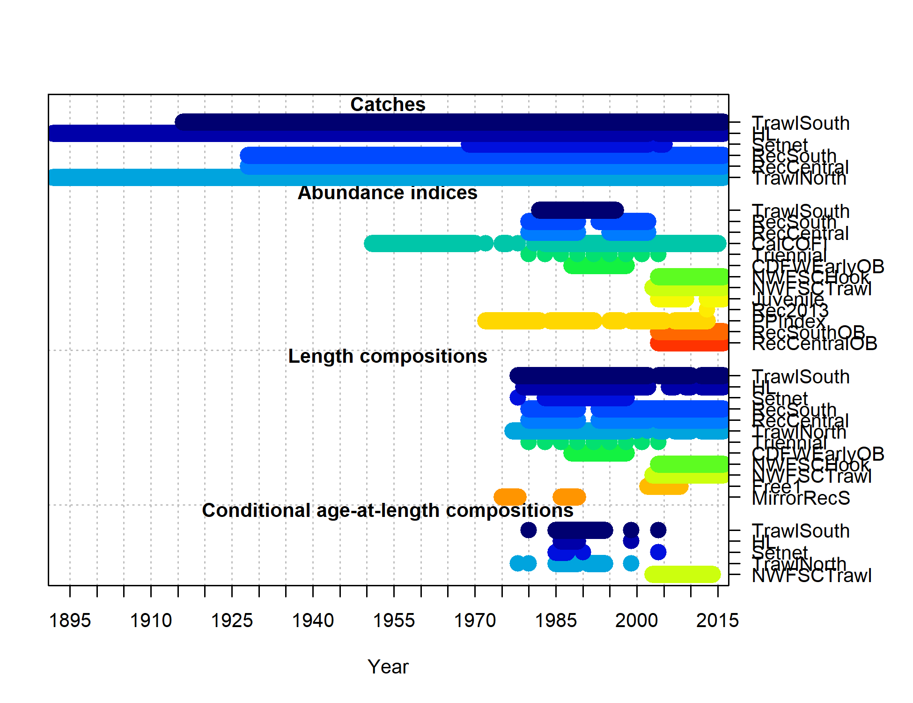

<!-- 
This script contains options for including figures produced by r4ss.
Option 1: Insert a figure using R markdown syntax and the name of the figure

Option 2: Insert a figure using R makrdown syntax and the figure number 
          from plotInfoTable.  If the figure location within plotInfoTable
          changes with a new run, the figure will also change.
          
Option 3: Insert a series of figures from an R code chunk.  I've parsed the 
          plotInfoTable into smaller tables by category (Bio, Sel, Catch, etc.)
          This is done in Preamble.R and you can view each table in the Global
          Environment. Currently these are all set up for model one (mod1). If you
          have multiple models you'll just copy the code to the correct place in 
          the document and change mod1 to the appropriate model number.
          
          I have set up the labels for these plots to be numbered.  For example, label
          fig:mod1_1_bio1_sizeatage, indicates this is a figure from model 1 (fig:mod1)
          and the next number (1 in this case) is the first plot from the Bio dataframe.
          You can print them all here in this document and then reference the labels 
          (printed by each figure) to decide which plots to include in the final document 
          before you copy the R code chunk to Assessment_template.  To reference a figure
          in the text, use the label or the plot location, either \ref(fig:mod1_1_bio1_sizeatage)
          or \ref{paste0(fig:mod1_1_', Bio_mod1[1,9])} where you've replaced the 'i's' with 
          the correct number.  The latter option is less intuitive when you're writine the 
          document and referecing figures.
          
          You can also print a series of plots and if a plot has multiple pages, only the first
          in the series will have the figure number and caption.
          
          Downfall to this option: you can either add code to change the caption,
          or change the caption in the plotInfoTable .csv if you don't like the 
          default, which will overwrite each time you run the Parse_r4ss_plotInfoTable.R 
          script within the 0-Run_r4ss_plots.R script, which should really be once with a
          final model...

Option 4: Insert two plots where you have a page1 and page2 and want the same
          caption (sort of a hack, but it works!)

You'll copy the code chunks from this file into the Assessment_template.Rmd to insert the figures.

To reference these figures in the document, use label created for each plot.
-->

```{r global_options, include=FALSE}
    # Do not worry about this R code chunk (unless you need to change the 
    # number of models) - it's a repeat from the Preamble.R file, so you 
    # can recreate the dataframes used for the tables
    # set global options for R code chunks: echo=FALSE (don't include source code); 
    # warning=FALSE (suppress R warnings); message=FALSE (suppress R messages)
    # eval = TRUE is default
     n_models = 1  ##CHANGE   

     knitr::opts_chunk$set(echo = FALSE, warning = FALSE, message = FALSE)
    options(xtable.comment=FALSE)
    
    library(xtable)    # create tables
    library(ggplot2)   # plotting
    library(reshape2)  # melt dataframes, etc
    library(scales)    # print percents
    library(knitr)

   # Load in the plotInfoTable and parse the table as an option to use for figures
   for(imod in 1:n_models) {
  if (imod==1) {
      mod_num = 'mod1'
    } else {
    if (imod==2) {
      mod_num = 'mod2'
    } else {
      mod_num = 'mod3'
    }}
  
  
  # Read in the plotInfoTable.csv containining the list of plots created from r4SS
  plotInfoTable = read.csv(paste0('C:/StockAssessment_template/r4ss/plots_',mod_num,'/plotInfoTable_',mod_num,'_final.csv'))
  
  # Replace the @ in A@L with AAL and the - in S-R with S_R
  # And get rid of other funny characters
  plotInfoTable$category = gsub('@', 'A', plotInfoTable$category)
  plotInfoTable$category = gsub('-', '_', plotInfoTable$category)
  plotInfoTable$caption  = gsub('@', 'A', plotInfoTable$caption)
  plotInfoTable$caption  = gsub('-', '_', plotInfoTable$caption)
  plotInfoTable$caption  = gsub('<br>|<blockquote>|</i>|<i>|</blockquote>', 
                               ' ',plotInfoTable$caption)
 
   
  # Change factors to strings
  plotInfoTable = data.frame(lapply(plotInfoTable, as.character), stringsAsFactors=FALSE)
  
  # Create a model-specific plotInfoTable
  assign(paste0('plotInfoTable_',mod_num),plotInfoTable)
  
  # Pull out the different categories of plots, e.g., Bio, Sel, Timeseries, etc
  categories = as.vector(unique(plotInfoTable$category))
  
  # Create a dataframe for each category - because you're running these from a 
  # .R file, you can view all of these dataframes in the Environment
  
  for(icat in 1:length(categories)){
    dummy_df = data.frame()
    dummy_df = subset(plotInfoTable,category==categories[icat])
    dummy_df = data.frame(lapply(dummy_df, as.character), stringsAsFactors=FALSE)
    dummy_df$label = substr(dummy_df$basename,1, nchar(dummy_df$basename)-4)
    dummy_df$filepath = paste0('./r4ss/plots_',mod_num,'/',dummy_df$basename)
    assign(paste0(categories[icat],'_',mod_num),dummy_df)
  }
} # end n_models

   # multiple models
   multi_page_fig = c('page2', 'page3', 'page4', 'page5', 'page6', 'page7')
  
  # Tells R which columns to look in for the caption, label and path 
  caption_col = 2
  label_col = 10
  path_col =  11

```


<!--========================================================================-->
<!-- Option 1: type out the code for a figure using the filename -->
<!-- YOU CANNOT USE EXTRA SPACES OR CARRIAGE RETURNS WITHIN THR IMAGE CODE
     You will have to change the directory here if you don't have the template
     in C:/Assessment_template (only for running the examples)


<!-- Plots have to be the same directory, or a subdirectory of the .Rmd file
     Copy the below code to the Assessment_template.Rmd document to use  -->
     



<!--========================================================================-->
<!-- Option 2: Call a plot using the plot number from the plotInfoTable.csv -->


<!-- Here we are calling the full file path name so we don't have the same directory
     issue as above.  You can either use the caption provided by plotInfoTable or replace
     it with your own.  Both options are shown.
     
     The danger in using the plotInfoTable to produce these figures, is that if the 
     figures change position in the file due to a new run, they will all shift...


![`r plotInfoTable_mod1[25,caption_col]` \label{`r paste0('fig:mod1_', plotInfoTable_mod1[25,5])`}](`r plotInfoTable_mod1[25,1]`)

![Writing my own caption. \label{`r paste0('fig:mod1_', plotInfoTable_mod1[25,5])`}](`r plotInfoTable_mod1[25,1]`)


<!--========================================================================-->
<!-- Option 3: Pull multiple figures at once from plotInfoTable using R 
               code chunks. I've parsed the plotInfoTable into the 14 dataframes,
               one each for of the plot types, e.g., biology, selectivity
               You can include about 15 plots in one loop, before LaTeX complains
               about too many floats
               
               R chunks are commented out so you can run them one by one.


<!-- Biology (Bio) r4ss plots --------------------------------------------- -->
```{r, results='asis'}
    # Plot all of the bio plots
    for(i in 1:dim(Bio_mod1)[1]) {

       # concatenate the caption column, label columnm and the plot location into the r Markdown
       # syntax so that when converted to LaTeX it'll print the plot
      cat('\n![', Bio_mod1[i,caption_col], ' \\label{fig:mod1_', i, '_', Bio_mod1[i,label_col], '}](', Bio_mod1[i, path_col], ')\n', sep='')
    }

```

\FloatBarrier

<!-- Selectivity (Sel) r4ss plots ----------------------------------------- -->
```{r, results='asis'}
    # Plot all of the selectivity plots - only plotting a select few here
#   for(i in 1:15) { #dim(Sel_mod1)[1]) {
#      cat('\n![', Sel_mod1[i,caption_col], ' \\label{fig:mod1_', i, '_', Sel_mod1[i, label_col], '}](', Sel_mod1[i, path_col], ')\n', sep='')
#}
```

\FloatBarrier

<!-- Timeseries r4ss plots ------------------------------------------------ -->
```{r, results='asis'}
    # Plot all of the timeseries plots
#     for(i in 1:dim(Timeseries_mod1)[1]) {
#        cat('\n![', Timeseries_mod1[i,caption_col], ' \\label{fig:mod1_', i, '_', Timeseries_mod1[i, label_col], '}](', Timeseries_mod1[i, path_col], ')\n', sep='')
# }
```
\FloatBarrier

<!-- Recruitment deviations (RecDev) r4ss plots --------------------------- -->
```{r, results='asis'}
#     # Plot all of the timeseries plots
#     for(i in 1:5) { #dim(RecDev_mod1)[1]) {
#       cat('\n![', RecDev_mod1[i,caption_col], ' \\label{fig:mod1_', i, '_', RecDev_mod1[i, label_col], '}](', RecDev_mod1[i, path_col], ')\n', sep='')
# }
```
\FloatBarrier

<!-- Stock-recuitment (S_R) r4ss plots ------------------------------------ -->
```{r, results='asis'}
    # Plot all of the timeseries plots
#    for(i in 1:dim(S_R_mod1)[1]) {
#      cat('\n![', S_R_mod1[i,caption_col], ' \\label{fig:mod1_', i, '_', S_R_mod1[i, label_col], '}](', S_R_mod1[i, path_col], ')\n', sep='')
#}
```

\FloatBarrier

<!-- Catch (Catch) r4ss plots --------------------------------------------- -->
```{r, results='asis'}
    # Plot all of the timeseries plots
#     for(i in 1:dim(Catch_mod1)[1]) {
#       cat('\n![', Catch_mod1[i,caption_col], ' \\label{fig:mod1_', i, '_', Catch_mod1[i, label_col], '}](', Catch_mod1[i, path_col], ')\n', sep='')
# }
```

\FloatBarrier

<!-- Spawning Potential Ratio (SPR) r4ss plots ---------------------------- -->
```{r, results='asis'}
    # Plot all of the timeseries plots
#     for(i in 1:dim(SPR_mod1)[1]) {
#       cat('\n![', SPR_mod1[i,caption_col], ' \\label{fig:mod1_', i, '_', SPR_mod1[i, label_col], '}](', SPR_mod1[i, path_col], ')\n', sep='')
# }
```

\FloatBarrier

<!-- Indices of Abundance (Index) r4ss plots ------------------------------ -->
```{r, results='asis'}
    # Plot all of the timeseries plots
#     for(i in 1:3) { #dim(Index_mod1)[1]) {
#       cat('\n![', Index_mod1[i,caption_col], ' \\label{fig:mod1_', i, '_', Index_mod1[i, label_col], '}](', Index_mod1[i, path_col], ')\n', sep='')
# }
```

\FloatBarrier

<!-- Numbers at age/length (Numbers) r4ss plots ---------------------------- -->
```{r, results='asis'}
    # Plot all of the timeseries plots
#     for(i in 1:3) { #dim(Numbers_mod1)[1]) {
#       cat('\n![', Numbers_mod1[i,caption_col], ' \\label{fig:mod1_', i, '_', Numbers_mod1[i, label_col], '}](', Numbers_mod1[i, pah_col], ')\n', sep='')
# }
```

\FloatBarrier

<!-- Composition (CompDat) r4ss plots -------------------------------------- -->
```{r, results='asis'}
 #    # Plot all of the timeseries plots
 #      for(i in 1:dim(CompDat_mod1)[1]) {
 # 
 #       # find matches to multi-page plots
 #       page_test = sapply(multi_page_fig, grepl, CompDat_mod1$label[i])
 #       
 #       # if the plot is page2+ of a series, add the extra caption
 #        if(TRUE %in% page_test) {
 #         cat('\n', sep='')
 #      
 #         cat('\\begin{center} \n
 #              Figure continued from previous page \n
 #             \\end{center}',sep='')
 #       
 #       } else {
 # 
 #       cat('\n![', CompDat_mod1[i,caption_col], ' \\label{fig:mod1_', i, '_', CompDat_mod1[i, label_col], '}](', CompDat_mod1[i, path_col], ')\n', sep='')
 # } }
```

\FloatBarrier

<!-- Length Composition (LenComp) r4ss plots ------------------------------- -->
```{r, results='asis'}
    # Plot all of the timeseries plots
      for(i in 1:10) { #dim(LenComp_mod1)[1]) {
       
        # find matches to multi-page plots
        page_test = sapply(multi_page_fig, grepl, LenComp_mod1$label[i])
       
       # if the plot is page2+ of a series, add the extra caption
        if(TRUE %in% page_test) {
         cat('\n', sep='')
      
         cat('\\begin{center} \n
              Figure continued from previous page \n
             \\end{center}',sep='')
       
       } else {

        cat('\n![', LenComp_mod1[i,caption_col], ' \\label{fig:mod1_', i, '_', LenComp_mod1[i, label_col], '}](', LenComp_mod1[i, path_col], ')\n', sep='')
 } }
```

\FloatBarrier

<!-- Age at Length Composition (AALComp) r4ss plots ------------------------ -->
```{r, results='asis'}
#     # Plot all of the timeseries plots
     for(i in 1:8){ #dim(AALComp_mod1)[1]) {
#         
#      # find matches to multi-page plots
      page_test = sapply(multi_page_fig, grepl, AALComp_mod1$label[i])
#      
#      # if the plot is page2+ of a series, add the extra caption
      if(TRUE %in% page_test) {
        cat('\n', sep='')
#       
        cat('\\begin{center} \n
              Figure continued from previous page \n
             \\end{center}',sep='')
#        
      } else {
#      
    cat('\n![', AALComp_mod1[i,caption_col], ' \\label{fig:mod1_', i, '_', AALComp_mod1[i, label_col], '}](', AALComp_mod1[i, path_col], ')\n', sep='')
 } }
```

\FloatBarrier

<!-- Yield (Yield) r4ss plots --------------------------------------------- -->
```{r, results='asis'}
    # Plot all of the timeseries plots
 #    for(i in 1:dim(Yield_mod1)[1]) {
 #       cat('\n![', Yield_mod1[i,caption_col], ' \\label{fig:mod1_', i, '_', Yield_mod1[i, label_col], '}](', Yield_mod1[i, path_col], ')\n', sep='')
 # }
```

<!--========================================================================-->
<!-- Option 4: Figures with multiple pages and one caption
     This is a hack....Pretend that there are 2 pages of data_plots...
     LaTeX will ignore a figure inserted via R markdown if there is not a blank
     line on either side.  It will not be a float and will not have a catpion.
     Here, I've added the centered text "Figure continued from previous page" that 
     will appear as text after the caption.  You can then continue on plotting.  
     You can see if we add another plot after this, the figure numbering continues
     normally.
     
     If you wish to to this, you will have to insert the text using the plot
     names, as I have here, or using the plotInfoTable index.
-->


\begin{center}
Figure continued from previous page
\end{center}


